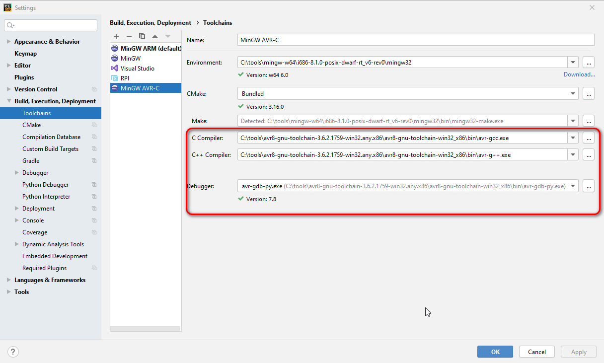
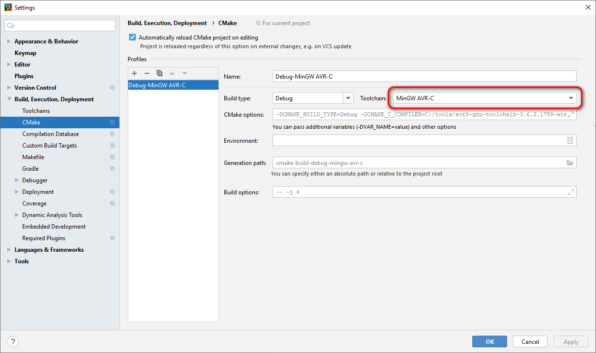
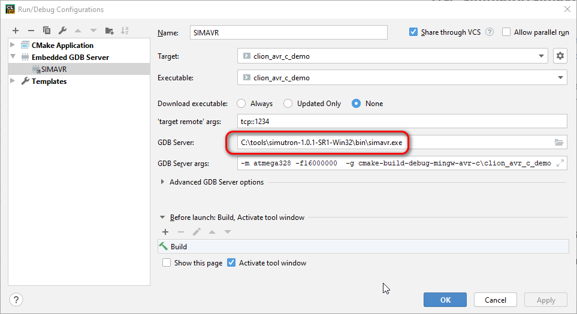

# Demo project CLion + Arduino Uno + AVR-GCC compiler
**Note** Debug is not supported yet
## Prerequirements
### Hardware
- [Arduino Uno or compatible board](https://store.arduino.cc/usa/arduino-uno-rev3)
### All platforms(MAC, Linux, Windows)
- [CLion 2020.1+](https://jetbrains.com/clion)
- [AVR8 GNU Toolchain](https://www.microchip.com/mplab/avr-support/avr-and-arm-toolchains-c-compilers)
- [avrdude](https://download.savannah.gnu.org/releases/avrdude/)
### Windows only
- [MinGW](https://sourceforge.net/projects/mingw-w64/)
- [Virtual COM port driver for Arduino](https://www.arduino.cc/en/Guide/DriverInstallation)
 
## HOWTO

### Use the project
- Open the project with CLion
- Setup a new CLion Toolchain (i.e. set compilators and debugger location) with your AVR8 GNU installation (*Settings -> Build, Execution, Deployment -> Toolchains*).
You may use either `avr-gdb-py` or `avr-gdb`. First one is better but requires Python to be installed.  

Screenshot 1

 

 

- Use the toolchain for the project (*Settings -> Build, Execution, Deployment -> CMake -> Toolchain:*)

Screenshot 2

 

 

- Adjust CMakeLists.txt settings, such as avrdude location and actual COM port
- Select *FLASH* run configuration
- Build it. Arduino yellow LED should start blinking about 1Hz
### Use simulator(simavr)
- Install the simulator
  - Linux, Mac, see https://github.com/buserror/simavr
  - Windows install (https://sourceforge.net/projects/simutron/files/), simavr comes with it
 - Open the project with CLion
 - Setup AVR toolchain and CMake as above
 - Open *SIMAVR* Run Configuaration and set actual path to simavr executable

Screenshot 3

 

 

- Set a breakpoint somewhere in your main()
- Select *SIMAVR*  Run Configuaration
- Click *Debug*
- Enjoj!
### Diagnose problems
* Uncomment avrdude verbose switch

### Use another AVR-based board
- Check if this repository contains a branch dedicated to your CPU
- Clone this project
- Make adjustments as in "Use the project"
- Open the project with CLion
- Correct *CMakeLists.txt*
    - Project name  in *add_executable()* clause 
    - List of source files in *add_executable*  clause
    - add *include_directories()* clause(s) if needed 
    - TARGET_CPU
    - FLASH custom target command line to reflect another hardware
